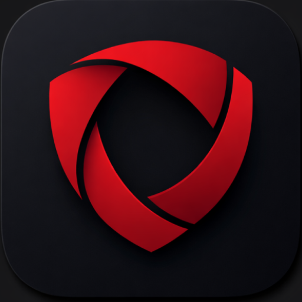

# Asfalis — Women's Personal Safety App

> **Landing page & IoT architecture demo** for Asfalis, an AI-powered women's personal safety Android app.

---

## About

Asfalis is a personal safety companion built for women — silent, smart, and always ready. This repository contains the **marketing landing page** and an **interactive IoT architecture simulation** that visualises how the app's backend pipeline works end-to-end.

🚀 **Launching May 2026** — currently in pre-launch.

---

## Pages

| Route | Description |
|---|---|
| `/` | Full marketing landing page with all sections |
| `/architecture` | Interactive IoT architecture simulation |

---

## Landing Page Sections

1. **Hero** — Headline, countdown to launch, "Notify Me" CTA
2. **Problem Statement** — Emotional context for why Asfalis exists
3. **Features** — 8 feature blocks (SOS, Shake-to-SOS, AI Auto SOS, IoT wearable, Live GPS, Verified Contacts, SOS History, Privacy)
4. **Why Asfalis** — Competitor comparison table
5. **How It Works** — 3-step setup guide
6. **Testimonials** — User quote cards
7. **Statistics** — WHO / IANS safety statistics with count-up animation
8. **Final CTA** — Email capture for launch notification
9. **Footer**

---

## Architecture Simulation

An interactive step-by-step visualisation of Asfalis's IoT backend pipeline:

- **Auto Loop** — Cycles through both monitoring paths (BLE wearable & phone sensors)
- **Trigger SOS** — Simulates a manual SOS dispatch
- **ML Anomaly** — Simulates AI-based danger detection
- Per-step phone screen mockups and cloud service flow diagrams

---

## Brand Colours

| Name | Hex |
|---|---|
| Deep Crimson | `#C0392B` |
| Ivory White | `#FAF9F6` |
| Charcoal | `#2C2C2C` |
| Blush Rose | `#F1948A` |
| Dark Teal | `#1A6B6B` |

---

---

## License

© 2026 Asfalis. All rights reserved.

> *"Safety isn't a privilege. It's a right."*
